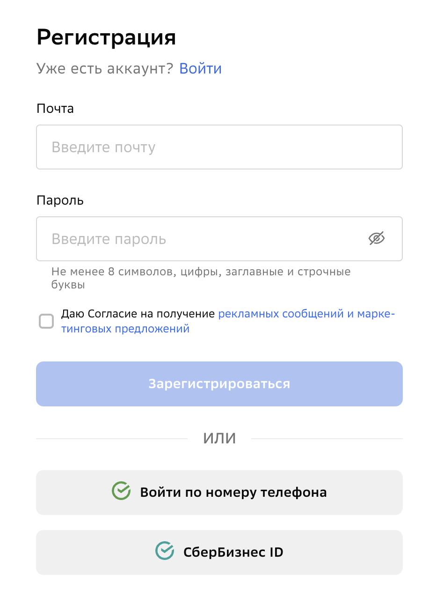
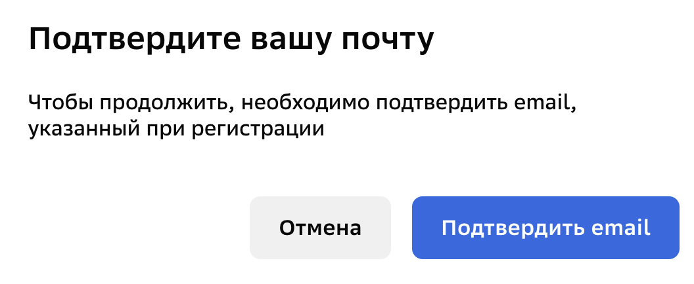
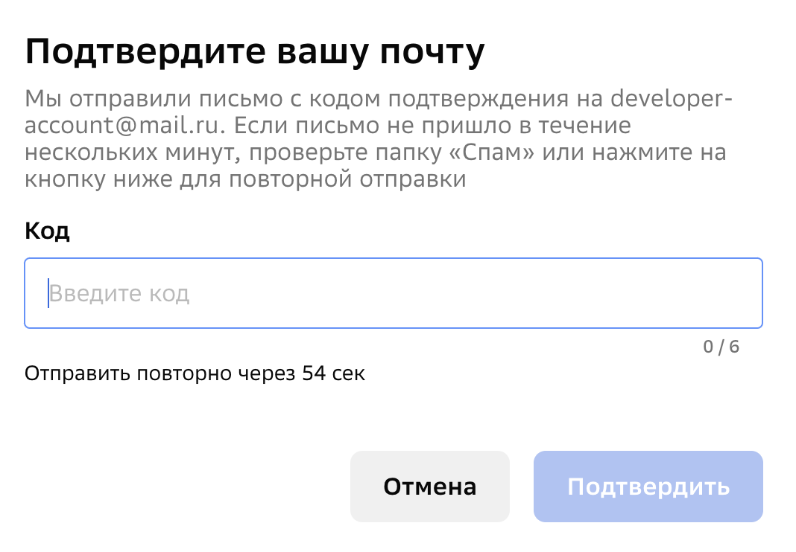
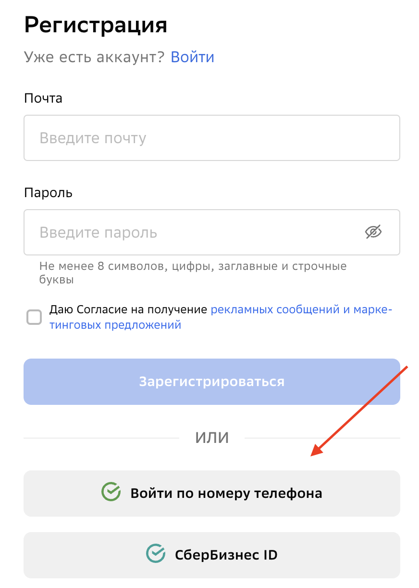
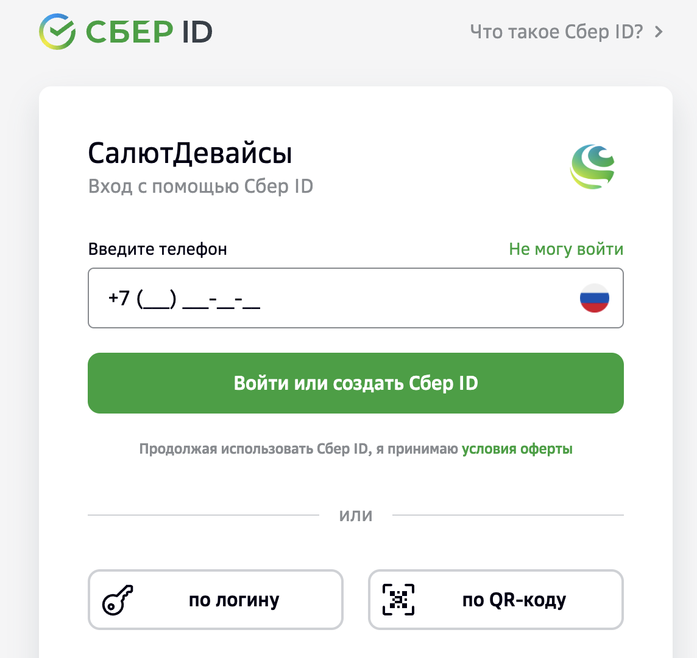

# Регистрация в Sber Developer

## Создание личного кабинета для физических лиц

### Регистрация по электронной почте

Физические лица могут зарегистрироваться на платформе [Studio](https://developers.sber.ru/) по электронной почте или через Сбер ID.

1. Откройте платформу [Studio](https://developers.sber.ru/).
2. В правом верхнем углу выберите **Личный кабинет**.
   
Откроется форма авторизации.

4. Нажмите **Регистрация**, чтобы перейти к созданию нового аккаунта.
   

4. В поле **Почта** введите адрес электронной почты, который вы будете использовать для входа в личный кабинет.
   
> [!IMPORTANT] 
> Убедитесь, что у вас есть доступ к указанной электронной почте – на неё будет отправлен код для подтверждения.

5. В поле **Пароль** установите пароль для аккаунта.
   
> [!NOTE]  
> Для безопасности вашего аккаунта пароль должен содержать не менее 8 символов, цифры, а также заглавные и строчные буквы.

6. Перейдите по ссылке и ознакомьтесь с условиями **Согласия на обработку персональных данных для получения рекламных сообщений**.
7. Поставьте галочку рядом с полем **Даю согласие на получение рекламных сообщений и маркетинговых предложений**, чтобы принять условия.
8. Нажмите **Зарегистрироваться**.

Ваша учётная запись зарегистрирована. Подтвердите электронную почту, чтобы использовать все возможности [Studio](https://developers.sber.ru/).

#### Как подтвердить адрес электронной почты?

Подтвердить указанный адрес электронной почты можно сразу после регистрации, следуя подсказкам во всплывающем окне.
Если вы пропустили уведомление:
1. Войдите в личный кабинет платформы [Studio](https://developers.sber.ru/).
2. Перейдите в раздел **Настройки профиля**. 
3. Нажмите **Подтвердить почту**.
4. Во всплывающем окне выберите **Подтвердить email**.
   
   
   
5. В поле **Код** введите код подтверждения из электронного письма.
6. Нажмите **Подтвердить**.
   

Ваша учётная запись активирована.

### Регистрация через Сбер ID

1. Откройте платформу [Studio](https://developers.sber.ru/).
2. В правом верхнем углу выберите **Личный кабинет**.
   
Откроется форма авторизации.

3. Нажмите **Регистрация**, чтобы перейти к созданию нового аккаунта.
   

4. Выберите **Войти по номеру телефона**.

   

Откроется форма регистрации через Сбер ID.

5. Введите ваш номер телефона и нажмите **Войти или создать Сбер ID**.

> [!NOTE] 
> Также вы можете войти в Сбер ID по логину или с помощью QR-кода. Выберите удобный способ авторизации и следуйте подсказкам на экране.

 У меня есть приложение «СберБанк Онлайн» 

В ваше мобильное приложение «СберБанк Онлайн» придёт push-уведомление. Откройте его и подтвердите вход в [Studio](https://developers.sber.ru/)

 У меня нет приложения «СберБанк Онлайн» 

Введите код из SMS-сообщения и нажмите **Подтвердить**.

Готово! Ваша учётная запись зарегистрирована. Теперь вы можете использовать все возможности [Studio](https://developers.sber.ru/).

